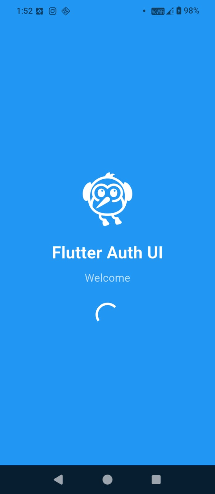
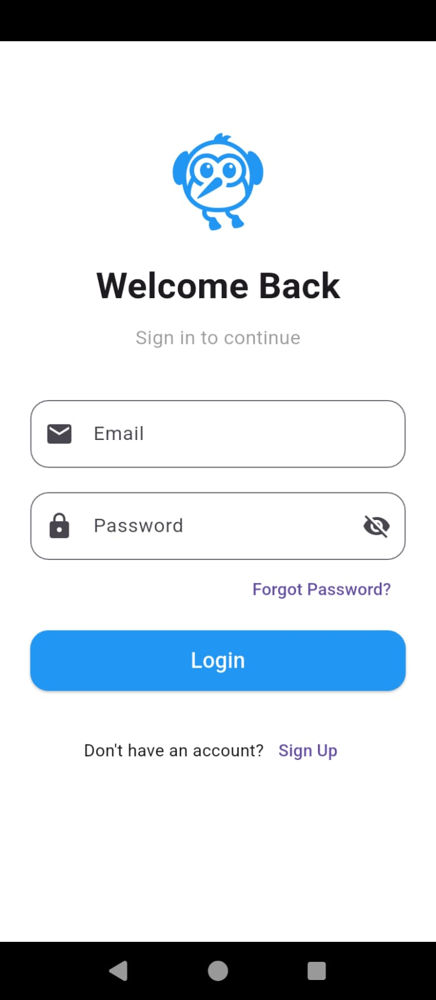
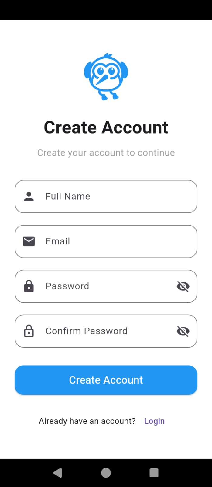
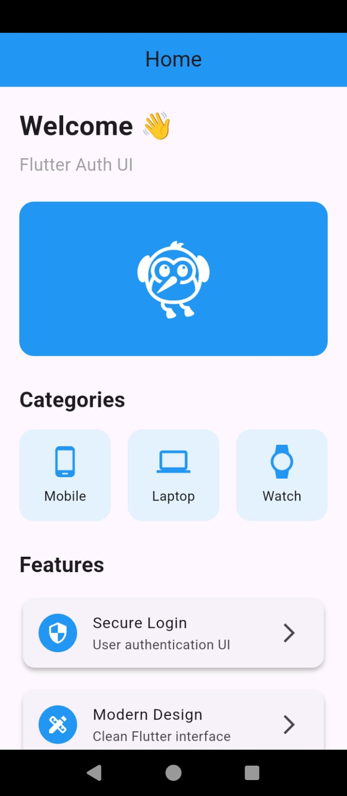

# 🚀 Flutter Auth UI

> **Week 1 Project** | **NextGenatix App Development Internship**

A modern Flutter application developed as part of the **NextGenatix 1-Month App Development Internship**. This project focuses on learning Flutter fundamentals, project structure, and building clean, responsive user interfaces.

---

## 📱 Project Overview

This application demonstrates the implementation of four essential UI screens commonly used in mobile applications:

- ✨ Splash Screen
- 🔐 Login Screen
- 📝 Sign Up Screen
- 🏠 Home Screen

The project is built using Flutter widgets and follows a clean folder structure for better code organization and maintainability.

---

## 🎯 Internship Objective

The primary goal of this project is to understand the fundamentals of Flutter development, including project setup, widget hierarchy, layouts, and user interface design.

---

## ✨ Features

- 🚀 Beautiful Splash Screen
- 🔐 Modern Login Screen
- 📝 Responsive Sign Up Screen
- 🏠 Clean Home Screen
- 📱 Responsive UI Design
- 🎨 Material Design Components
- 📂 Organized Project Structure
- 💙 Beginner-Friendly Flutter Code

---

## 🛠️ Built With

- Flutter
- Dart
- Material Design

---

## 📂 Project Structure

```text
lib/
│
├── main.dart
│
├── screens/
│   ├── splash_screen.dart
│   ├── login_screen.dart
│   ├── signup_screen.dart
│   └── home_screen.dart
│
├── widgets/
│
├── utils/
│
assets/
│
├── images/
└── icons/
```

---
## 📸 Screenshots

### 🚀 Splash Screen



---

### 🔐 Login Screen



---

### 📝 Sign Up Screen



---

### 🏠 Home Screen



---

## 🚀 Getting Started

Clone the repository

```bash
git clone https://github.com/SaudMasood/flutter-auth-ui.git
```

Navigate to the project

```bash
cd flutter-auth-ui
```

Install dependencies

```bash
flutter pub get
```

Run the application

```bash
flutter run
```

---

## 📚 Topics Covered

- Flutter Installation
- Project Structure
- Scaffold
- AppBar
- Text
- Image
- Icon
- TextField
- ElevatedButton
- Row & Column
- Container

---

## 🎯 Internship Information

**Organization:** NextGenatix

**Internship:** App Development Internship

**Duration:** 1 Month

**Week:** 1

**Project:** Flutter Setup & Basic UI

---

## 👨‍💻 Developed By

**Saud Masood**

BS Computer Science Student

Flutter Developer

GitHub: https://github.com/SaudMasood

LinkedIn: *(Add Your LinkedIn URL)*

---

## 📄 License

This project is licensed under the **MIT License**.

Copyright (c) 2026 Saud Masood

---

## ⭐ Support

If you found this project helpful, consider giving it a ⭐ on GitHub.

Happy Coding! 💙
